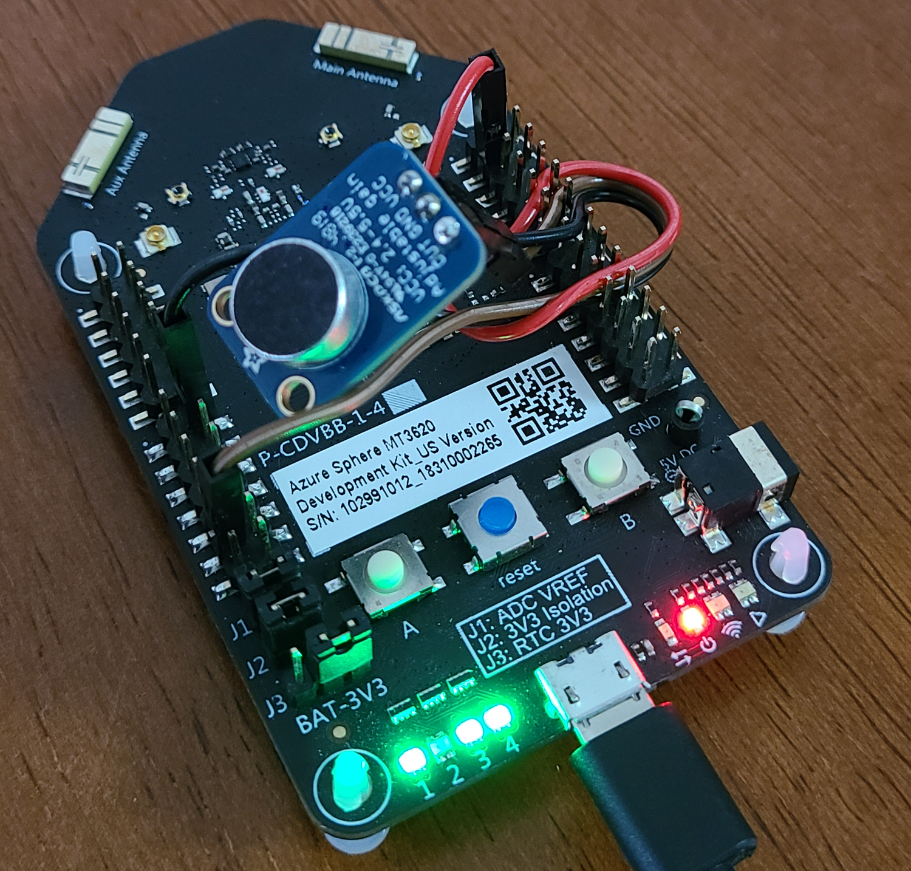

## Overview


We show machine learning model deployment on [MT3620 Azure Sphere](https://azure.microsoft.com/en-us/services/azure-sphere/get-started/) using [Apache TVM](https://tvm.apache.org/). We show multiple deployments from a simple ```a + b``` example to a ```Conv2D``` operation and finally we deploy [Keyword Spotting](https://github.com/ARM-software/ML-KWS-for-MCU) model developed by ARM.

## Hardware Requirements
- Linux machine
- [MT3620 Azure Sphere board](https://www.seeedstudio.com/Azure-Sphere-MT3620-Development-Kit-US-Version-p-3052.html)
- micro USB cable
- [MT3620 Ethernet Shield](https://www.seeedstudio.com/MT3620-Ethernet-Shield-v1-0-p-2917.html) (only for tuning)

## Software Requirements
- Linux with Azure Sphere SDK (follow [Azure Sphere documentation](https://docs.microsoft.com/en-us/azure-sphere/) to setup SDK and device)
- Python 3.6+
- Tensorflow

## Getting Started
1. Clone this repository (use ```git clone --recursive``` to clone submodules)
2. [Install TVM](https://docs.tvm.ai/install/from_source.html)
   - **NOTE:** Ensure you enable LLVM by setting ```set(USE_LLVM ON)```. (This repository has been tested against LLVM-10)
   - **NOTE:** Checkout ```f5b02fdb1b5a7b6be79df97035ec1c3b80e3c665``` before installation.
3. Setup virtual env
```bash
$ python3 -mvenv _venv
$ . _venv/bin/activate
$ pip3 install -r requirements.txt -c constraints.txt
$ export PYTHONPATH=$(pwd)/python:$PYTHONPATH
$ export PYTHONPATH=$(pwd)/3rdparty/ML_KWS:$PYTHONPATH
```

## Prepare the Hardware
1. Connect Azure Sphere board to PC with micro USB cable.
2. In the current directory run ```make connect``` to connect to device. (This requires ```sudo``` access)
3. Enable evelopment by running ```make enable_development``` command.
4. Optional: Follow this to enable network capability:
   - Disconnect the device and attach the network shield.
   - Setup static IP
   ```bash
   Address 192.168.0.10
   Netmask 24
   Gateway 192.168.0.1
   ```

## Run Samples
The basic sample is ```a + b``` operation. In this example, we deploy a simple operation on Azure Sphere using [C Runtime](https://github.com/apache/incubator-tvm/tree/master/src/runtime/crt) from TVM. To deploy this follow these instructions:
```bash
$ make delete_a7
$ make cleanall
$ make test
$ make program
```
After programming the Azure Sphere, it reads TVM graph and parameters from FLASH and creates the runtime. Then it will read input data from FLASH, pass it to the TVM Relay model and finally compares the output with expected output from X86 machine. If the result maches, LED1 on the Azure Sphere would change to green.

Next sample is ```Conv2D``` operation. To run this example, follow previous instructions and use ```conv2d``` instead of ```test```. If you want to use network capabilities, use ```-DAS_NETWORKING=1```. Make sure to follow previous instruction on conecting Ethernet shield to Azure Sphere and setup the network.

## Debugging
Azure Sphere provides debugging capabilities over the micro USB connection with no extra hardware requirements. To use debugger open [Visual Studio Code](https://code.visualstudio.com/) in current directory and follow [instructions](https://docs.microsoft.com/en-us/azure-sphere/install/development-environment-linux).
To enable debugging in samples follow these:
1. Build the sample with these options:```-DAS_DEBUG=1 -DAS_NETWORKING=1``` or change them in [config](./include/config.h) file.
2. Run TCP server to receive messages:
```bash
$ python3 -m network.tcp_server
```
3. Use Start Debugging option in VsCode

## Keyword Spotting (KWS) Model on Azure Sphere
We deploy KWS, a tensorflow model developed by ARM, on Azure Sphere Cortex-A7 core using TVM. To enable this, we need to follow several steps as I explain in following. But to see the final deployment quickly, run these commands to deploy KWS model on Azure Sphere. In this deployment, we use a relay quantized KWS DS-CNN model. We build this model in TVM along with one of the WAV files in [samples](./python/models/kws/samples) as input data. Then we run this model on Azure Sphere and compare the TVM output with expected result from X86. If the result matches, we see a green LED on the board.
```bash
$ make delete_a7
$ make cleanall
$ make kws
$ make program
```
In following subsection, we explain how we achieve this deployment in more details.

### Importing KWS, Quantization and Accuracy Test
KWS models are originally developed in Tensorflow. Here we focus on [DS-CNN pre-trained models](https://github.com/ARM-software/ML-KWS-for-MCU/tree/master/Pretrained_models/DS_CNN) provided by ARM. To import the model and perform Relay quantization, run this command. This will save the relay module as a pickle file which we can use to build the runtime.
```bash
python3 -m model.kws.kws --export --quantize --global-scale 4.0 -o build
```
Here is the output:
```
INFO: Quantizing...
INFO: Global Scale: 4.0
INFO: build/module_gs_4.0.pickle saved!
```

To test the accuracy of the quantized model run the following. This will load the Relay module and run ```1000``` audio samples from KWS dataset and shows the accuracy.
```bash
$ python3 -m model.kws.kws --test 1000 --module build/module_gs_4.0.pickle 
```
This task will take few minutes the first time because of downloading the dataset. Here is the output:
```
INFO: testing 1000 samples
Accuracy for 1000 samples: 0.907
```
Now, we can build TVM runtime graph using this module. This command uses the saved quantized model to build runtime graph with no tuning.
```bash
$ python3 -m build_model --keyword --module build/module_gs_4.0.pickle -o build
```
Here is the output:
```
INFO: keyword_model.o saved!
INFO: keyword_graph.bin saved!
INFO: keyword_graph.json saved!
INFO: keyword_params.bin saved!
...
INFO: sample audio file used: python/model/kws/samples/silence.wav
INFO: keyword_data.bin saved!
INFO: keyword_output.bin saved!
```

### Auto-tuning

## Real-time Demo
We deployed an end-to-end demo of Keyword Spotting model on Azure Sphere. We implemented audio pre-processing and microhpnone interface on Cortex-M4 as a [partner application](./apps/kws_mic) and TVM on Cortex-A7.

1. Connect a Microphone with analog interface to Azure Sphere ADC interface (we used [MAX4466](https://www.adafruit.com/product/1063)). Follow instruction from the partner App.
   - **NOTE:** if you don't have a microphone, you can deploy ```DEMO1``` from partner app which reads pre-recorded data from memory.
2. Follow the steps in [apps/kws_mic/README.md](./apps/kws_mic/README.md) to deploy partner app on Cortex-M4. You can choose ```DEMO1``` (pre-loaded .wav file) or ```DEMO2``` (recorded live from microphone).
3. Deploy the TVM runtime application on Cortex-A7:
   ```
   make cleanall
   make kws_demo
   make program
   ```
4. If you push ```button B```, it acquires one second speech from microphone and shows the result label on four LEDs. Here are the LED colors for each label.

   Label | Yes | No | Up | Down | Left | Right
   --- | --- | --- | --- |--- |--- |---
   LEDs | :black_circle::black_circle::green_heart::green_heart: | :black_circle::black_circle::red_circle::red_circle: | :black_circle::black_circle::green_heart::black_circle: | :black_circle::black_circle::large_blue_circle::black_circle: | :white_circle::black_circle::black_circle::black_circle: | :black_circle::black_circle::black_circle::white_circle:
   **Label** | **On** | **Off** | **Stop** | **Go** | **Silence** | **Unknown**
   LEDs | :white_circle::black_circle::white_circle::white_circle: | :red_circle::black_circle::black_circle::black_circle: | :red_circle::black_circle::red_circle::red_circle: | :green_heart::black_circle::green_heart::green_heart: | :black_circle::black_circle::black_circle::large_blue_circle: | :black_circle::black_circle::black_circle::green_heart:

## References
Here are some of the references used in this project:

- [Incubator TVM](https://github.com/apache/incubator-tvm)
- [TVM Documentation](https://tvm.apache.org/docs/)
- [Azure Sphere Samples](https://github.com/Azure/azure-sphere-samples)
- [Keyword spotting on Arm Cortex-M Microcontrollers](https://github.com/ARM-software/ML-KWS-for-MCU)
